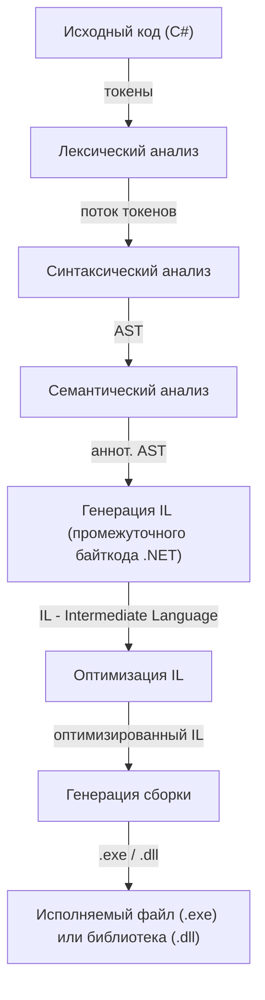

## Диаграмма фаз компиляции будущего компилятора на C#

**Ниже представлена блок-схема, описывающая основные этапы работы компилятора,
который будет реализован на языке C#. В качестве промежуточного представления
используется IL (Intermediate Language) — байткод платформы .NET**

